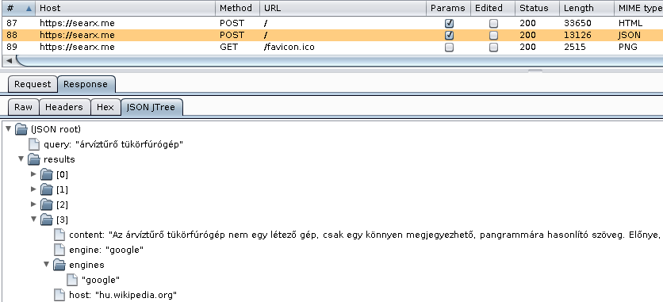

JSON JTree viewer for Burp Suite
================================

Building
--------

Execute `ant`, and you'll have the plugin ready in `burp-json-jtree.jar`

Dependencies
------------

 - JDK 1.7+ (tested on OpenJDK 8, Debian/Ubuntu package: `openjdk-8-jdk`)
 - Apache ANT (Debian/Ubuntu package: `ant`)

License
-------

The whole project is available under MIT license, see `LICENSE.txt`,
except for the [Mjson library][1], where

> The source code is a single Java file. [...] Some of it was ripped
> off from other projects and credit and licensing notices are included
> in the appropriate places. The license is Apache 2.0.

[1]: https://bolerio.github.io/mjson/
